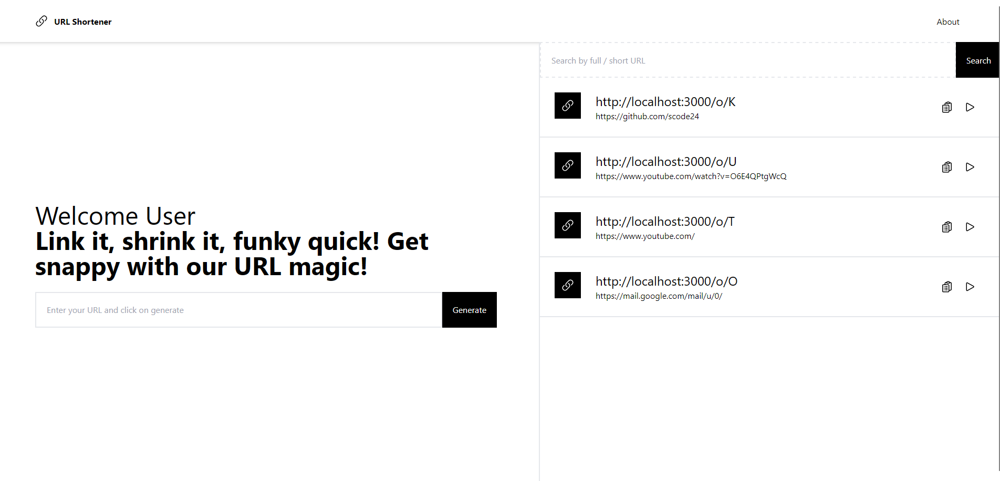
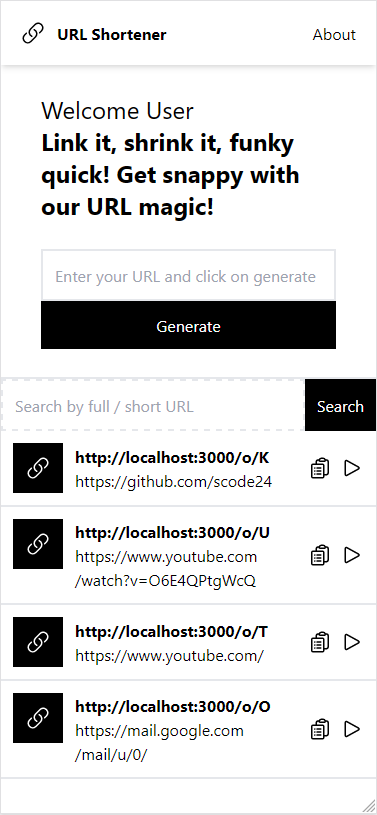

# URL Shortener

    
    

The URL Shortener app is a personal side project developed by Soumyabrata Sarkar. It is designed to provide users with a simple and efficient solution for generating and managing short URLs, making it easier for them to share links and access sites with minimal effort.

## Technologies Used

The app is built using the following technologies:

- Front-end: React.js
- Back-end: Spring Boot
- Database Access: JPA
- Database: MySQL

## Features

1. URL Shortening:
   Users can input a long URL, and the app will generate a shortened version of it. This feature makes it more convenient for users to share and use URLs with reduced length.

2. Access Using Short URL:
   The app generates short URLs for long URLs, and these short URLs can be used to access the corresponding original long URLs. When a user enters a short URL in the browser, they will be automatically redirected to the original long URL.

3. User-Friendly Interface Options:
   The app provides a user-friendly interface that enhances the user experience. Users can effortlessly open the original site directly from the UI with just a click. Moreover, they can easily copy the short URL to share it with others, simplifying the sharing process.

4. Automatic Deletion of Unused Short URLs:
   To ensure system efficiency and prevent clutter, the app automatically deletes short URLs that have not been accessed in the last 10 days. This automated process keeps the system clean and tidy.

## How to Use the App

To use the Short URL Generator app, follow these steps:

1. Input Long URL:
   On the app's interface, enter the long URL that you want to shorten in the provided input field.

2. Generate Short URL:
   Click on the "Generate Short URL" button to generate a shortened version of the input long URL.

3. Access Sites Using Short URLs:
   Once the short URL is generated, you can share it with others. When users enter the short URL in their browser, they will be automatically redirected to the original long URL.

4. Copy Short URL:
   The app offers an option to copy the generated short URL. Simply click on the "Copy" button next to the short URL to copy it to your clipboard and share it easily.

5. Automatic Deletion:
   The app automatically cleans up and deletes short URLs that have not been accessed in the last 10 days. You don't need to worry about maintaining the short URLs that are no longer in use.

## Deployment

The Short URL Generator app can be deployed on any server capable of hosting React.js and Spring Boot applications. Before deploying, make sure to set up the necessary MySQL database for storing the short URLs.

## Acknowledgments

We would like to thank all the contributors and developers who have contributed to the development of this app.